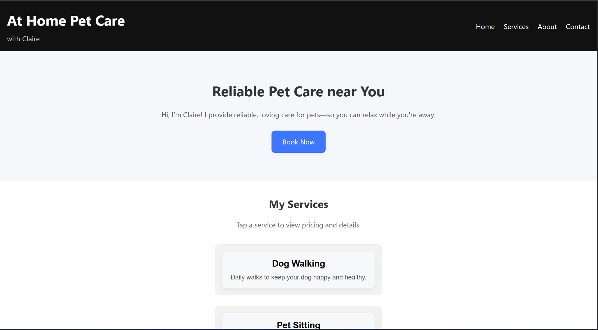
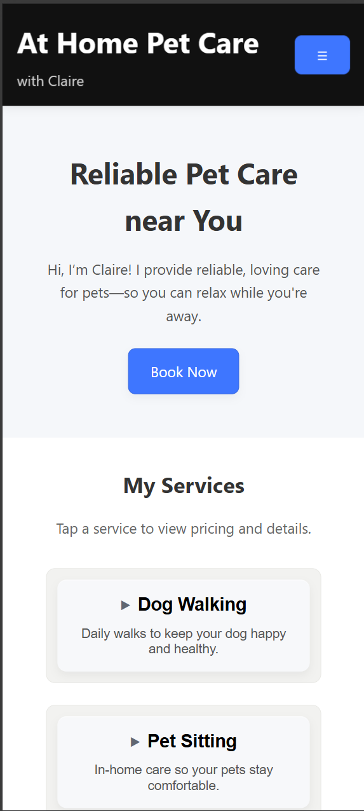

# At Home Pet Care Website 

This is a responsive multi-page website created for my small pet care business. This project focused on building trust, clear communication, and a clean user experience for potential customers across desktop and mobile devices. 

The website was built using HTML, CSS, and JavaScript with a focus on responsive design, accessibility, and modern UI practices. 

## Live Site 

https://tachyon847.github.io/at-home-pet-care/ 

## GitHub Repository 

https://github.com/Tachyon847/at-home-pet-care

---

## Homepage Screenshots

  

  

 

 

  <em>Homepage layout demonstrating responsive desktop (left) and mobile (right) user experiences.</em>

---

## Features 

- Responsive desktop and mobile layouts 
- Mobile hamburger navigation menu 
- Scroll-responsive mobile header behavior 
- Expandable layered service cards with responsive hover and accessibility-focused interaction cues 
- Smooth scrolling navigation 
- Accessibility improvements using ARIA attributes 
- Custom portrait gallery page with interactive lightbox, keyboard accessibility, and zoom support 
- GitHub Pages deployment 

--- 

## Technologies Used 

- HTML5 
- CSS3 
- JavaScript 
- Git & GitHub 
- GitHub Pages 
- VS Code 

--- 

## Project Goals 

This project was created as a hands-on front-end development exercise while also serving as a real website for my independent pet care business. 

The primary goals were to: 
- create a responsive and approachable user experience across desktop and mobile devices 
- provide clear service information and simple customer contact options 
- strengthen front-end development skills using HTML, CSS, and JavaScript 
- implement interactive UI features and accessibility-focused improvements 
- complete a full deployment workflow using GitHub and GitHub Pages 

--- 

## Design Focus 

The interface was intentionally designed around: 
- clean visual hierarchy and readable spacing 
- approachable typography and restrained color usage 
- soft layered depth and subtle hover motion 
- responsive layouts optimized for desktop and mobile devices 
- consistency between service pages and portrait gallery presentation 
- accessibility-conscious interaction and focus states

Additional refinement passes focused on improving visual clarity across different screen qualities, brightness levels, and device types while maintaining a calm and professional presentation style. 

--- 

## Development Notes 

This project was designed, developed, and deployed from the ground up in approximately 14–16 hours as an accelerated front-end development refresh and portfolio project, followed by two additional half-days of UI and usability refinement after observing real user interaction patterns. 

Modern AI-assisted development tools were used to: 
- accelerate debugging and troubleshooting 
- research updated front-end development practices 
- improve development workflow efficiency 
- explore responsive design techniques and UI refinement 

All implementation decisions, testing, design iteration, deployment, and feature integration were completed directly as part of the learning and development process. 

---

## Additional Documentation

Detailed version history, design iterations, and development notes are available in [DEVNOTES](DEVNOTES.md).

--- 

## Planned Improvements 

Future planned additions and enhancements include: 

- Drag-to-pan gallery lightbox support
- Payment integration (PayPal or Stripe)
- Booking and Policies page
- Custom domain integration
- Image optimization pipeline
- Data-driven gallery and testimonial publishing workflow
- Interactive testimonial carousel with pet photos
- Additional keyboard accessibility support
- Basic booking request form and calendar integration
- Authenticated administrative content management tools
- Secure client information and booking management system

---

## Author

Claire West

GitHub: https://github.com/Tachyon847